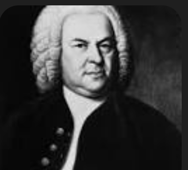
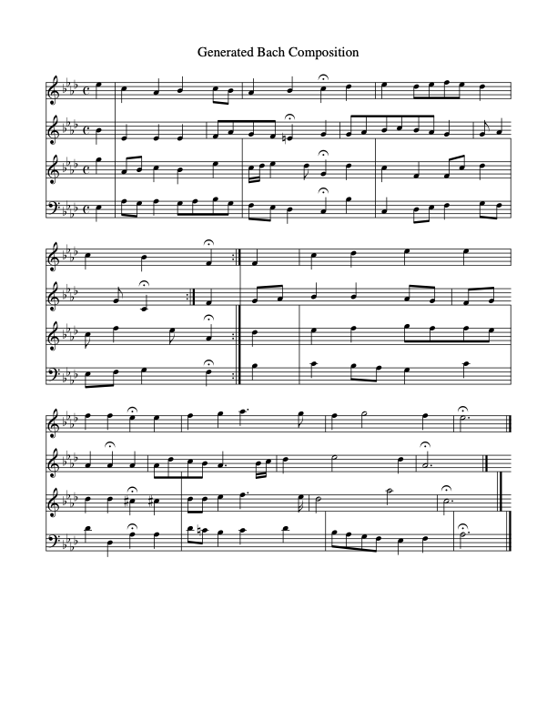

# Clavier

    

Clavier is a 12M parameter language model that generates sheet music and MIDI files for new compositions in the style of classical master composers like Bach, Beethoven, Chopin, etc. 

Example model output:

    

[ABC Notation](generated/composition_01.abc)

[MIDI file](generated/composition_01.mid)

## Architecture

Coming Soon

